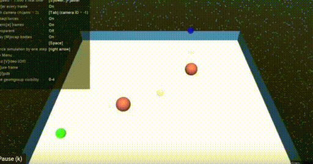
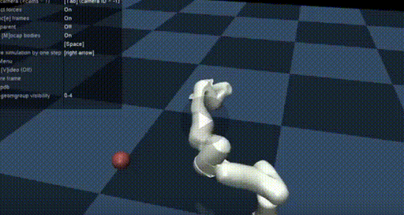

# torch-fabrics
Implementation of Geometric Fabrics using PyTorch with environments in MuJoCo and Gymnasium (formerly OpenAI Gym).

## Using this repo
```
conda env create -f environment.yml
conda activate fabrics
```

To run an example:
```
python panda_example.py
```

The transform tree is based on the same structure as that used in the [RMP2 framework](https://arxiv.org/abs/2103.05922).

## TODOs
- RK4 integration option during stepping (+accuracy, -speed)
- `fabric_solve` in `fabrics.py` uses the naive method (Algorithm 3) from the RMP2 paper. Could we instead improve the complexity by using Algorithm 4?
- Implement more examples of fabrics
- Tune existing fabrics
- Correctness verification (i.e. does this adhere to the design invariants required by fabrics?)
- Create more abstractions for more general purpose fabric design
- swappable transform tree structure

## Examples
You'll have to tune fabric parameters because I forgot the parameters I used to get these videos a while ago and the current parameters give different behavior.
### Point mass


### Panda arm


## See more
- [Geometric Fabrics for the Acceleration-based Design of Robotic Motion](https://arxiv.org/pdf/2010.14750.pdf)
- [Fabrics.jl](https://github.com/adubredu/Fabrics.jl), a Julia implementation of Geometric Fabrics by Alphonsus Adu-Bredu
- [Fabrics (with JAX)](https://github.com/cohnt/Fabrics), a JAX implementation of Geometric Fabrics by Thomas Cohn
- [RMP2: A Structured Composable Policy Class for Robot Learning](https://arxiv.org/abs/2103.05922)
- [RMP2 Codebase](https://github.com/UWRobotLearning/rmp2)
